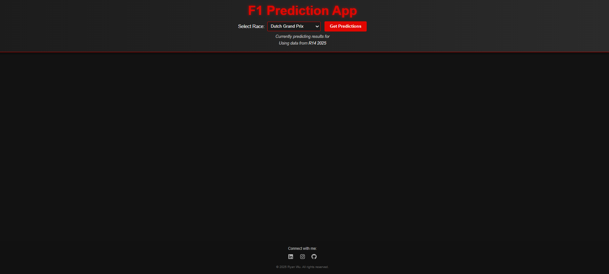

# 🏎️ F1 Prediction App

A sleek, modern Formula 1 prediction web app that uses machine learning to forecast qualifying and race results for upcoming F1 events.
The app presents predictions side-by-side with confidence scores, dynamic driver images, and a responsive, F1-inspired interface.

---

## 🚀 Features

- 🗓 **Upcoming Race Selector** – Choose from upcoming races in the current season.
- 📊 **Dual Predictions Display** – See both Qualifying and Race predictions at the same time.
- 🤖 **ML-Powered Forecasts** – Backend model predicts position, score, standard deviation, and confidence.
- 🏁 **Driver Hover Images** – Hover over a driver to view their profile image.
- 📱 **Responsive Design** – Optimized for desktop and mobile devices.
- 🎨 **Modern F1 Styling** – Inspired by Formula 1 branding, with a dark theme and accent colors.
- 🏆 **Interactive Tables** – Highlight podium positions and animate on hover.
- 📊 **High R² values** - around 91%
- 📉 **Low MSE values** - around 2.894
- 🌲 **Random Forest Regressor** – Core ML algorithm powering the predictions.

---

## 📦 Dependencies
- numpy
- pandas
- sklearn
- glob
- joblib
- fastf1
- shap
- fastapi
- pydantic
- uvicorn

## 🛠️ Tech Stack

**Frontend**
- React + Vite
- Modern CSS + Flexbox

**Backend**
- Python
- FastAPI
- Pandas / NumPy

**Machine Learning**
- Scikit-learn
- FastF1 API
- Joblib

---
## 📸 Screenshots
### Home Screen

### Predictions View


## ⚡ Installation

### 1️⃣ Clone the repository
```bash
git clone https://github.com/LMRW5/f1-prediction-app.git
cd f1-prediction-app
```

### 2️⃣ Backend setup
```bash
cd API
pip install -r requirements.txt
uvicorn main:app
```

3️⃣ Frontend setup
```bash
cd client
npm install
npm run dev
```

## 🎯 Usage
1. Start both backend and frontend servers.

2. Open the frontend in your browser (Vite will show you the local dev URL).

3. Select an upcoming race from the dropdown.

4. Click Get Predictions.


## 📬 Contact

Ryan Wu

Email: kkryan42@gmail.com

GitHub: [LMRW5](https://github.com/LMRW5)